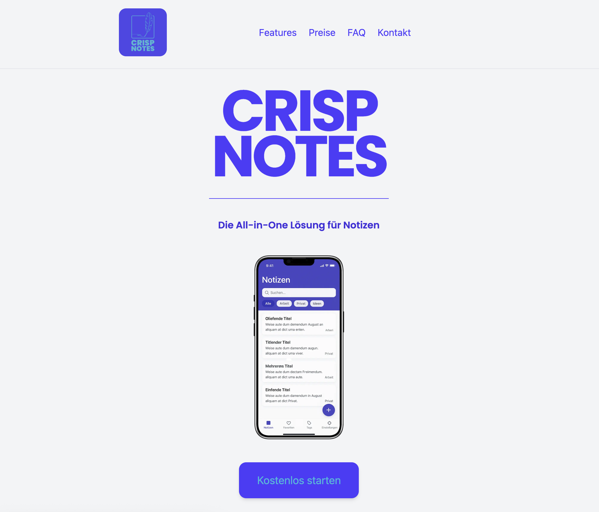

# CrispNote Landingpage

Willkommen zur **CrispNote Landingpage** 🎉  
Dies ist ein Projekt, das mit **Vite** und **Tailwind CSS** erstellt wurde. Ziel ist es, eine minimalistische und moderne Produktseite für eine fiktive Notiz-App namens _CrispNote_ zu entwickeln.

---

## 📸 Vorschau

--

## 🚀 Technologien

- **Vite** – schnelles Build-Tool für moderne Frontend-Projekte
- **Tailwind CSS** – Utility-first CSS Framework für schnelle UI-Entwicklung
- **HTML & JavaScript** – für Struktur und Interaktivität
- **Git & GitHub** – Versionskontrolle und Deployment

---

## 🎨 Design-Vorgaben

- **Farben**

  - Primär: `#1F2937` (dunkles Grau, modern & minimalistisch)
  - Akzent: `#3B82F6` (Blau für Buttons & Highlights)
  - Hintergrund: `#F9FAFB` (hell, klar, clean)
  - Text: `#111827` (fast schwarz, hohe Lesbarkeit)

- **Schriften**
  - **Heading:** „Poppins“ (klar & modern)
  - **Body:** „Inter“ (gut lesbar für Fließtexte)

---

## 📂 Projektstruktur

rispnote-landingpage/
│── public/ → Statische Dateien (Logo, Bilder, Icons)
│── src/
│ ├── assets/ → Bilder, Illustrationen, Icons
│ ├── styles/ → Tailwind + Custom CSS
│ ├── main.js → JavaScript Logik
│ └── index.html → Hauptseite
│── package.json → Projektkonfiguration
│── tailwind.config.js → Tailwind Setup
│── README.md → Projektdokumentation

---

## ✨ Features

- Responsives Layout (Mobile, Tablet, Desktop)
- Landingpage mit Hero-Section, Feature-Überblick und Call-to-Action
- Interaktives FAQ-Akkordeon (JS + Tailwind)
- Cleanes, modernes Design mit klarer Typografie

---

## 📌 Learnings

Dieses Projekt dient als Übung für:
• den Einsatz von Tailwind CSS in Kombination mit Vite
• die saubere Strukturierung eines Projekts
• die Nutzung von Git & GitHub für Teamarbeit und Deployment

---

## 📝 Lizenz

Dieses Projekt ist zu Lernzwecken erstellt und kann frei angepasst und erweitert werden.
